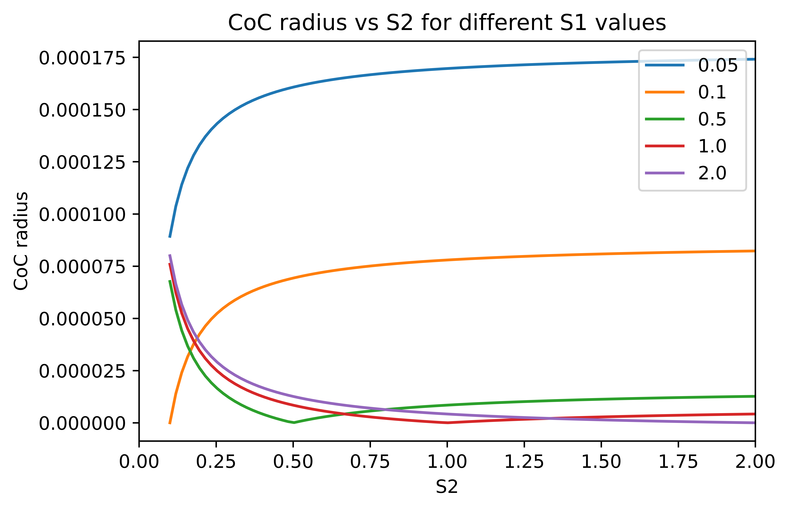
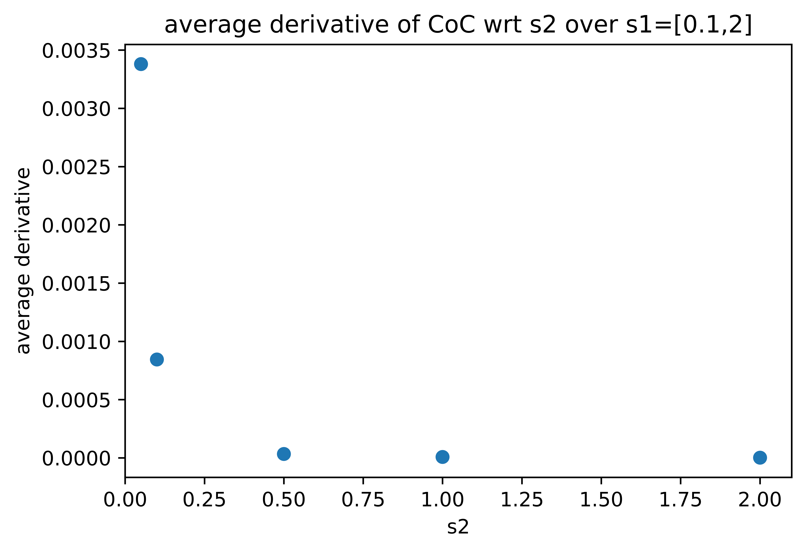

# Analyzing depth equation 

The radius of the Circle of Confusion (CoC) depends on other parameters according to the following equation:

$$|S_2-S_1|f^2 \over S_1N(S_1-f) $$

where $S_1$ is the focal distance, $S_2$ is the distance to the object point, $f$ is the focal length \
and $N$ is the f-number of the lense.

The variation of $CoC$ vs $S_1$ for different values of $S_2$ can be plot as the figure bellow. This was plot for the camera parameters used to generate the synthetic dataset for the paper "Focus on defocus: bridging the synthetic to real domain gap for depth estimation" by Maximov et.al (2020). These parameter and the dataset can be found at \
https://github.com/dvl-tum/defocus-net

If we plan to measure $S_2$ given $CoC$, the sections with high slope in the above curves give better values of $S_2$. This is because, if the slope is low, a small change in $CoC$ such as noise can have a large impact on the estimated $S_2$ value. To see the variation of the derivation of $CoC$ w.r.t. $S_2$, we plot it vs $S_1$. 

We can see that high derivatives are available when $S_1$ values are lower. So if we are trying to estimate 
$S_2$, we can give more weight to the estimations derived from lower $S_1$ values. 

How does the derivative varry with $S_2$ ? We plot the average derivative of $CoC$ (averaged over different $S1$ values)

From this plot, we can see that the robustness of the estimation of $S_2$ is higher for lower distances and diminishes when the distance decreases. 

