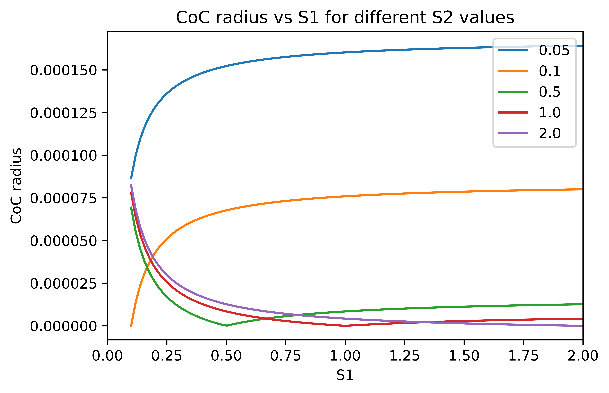
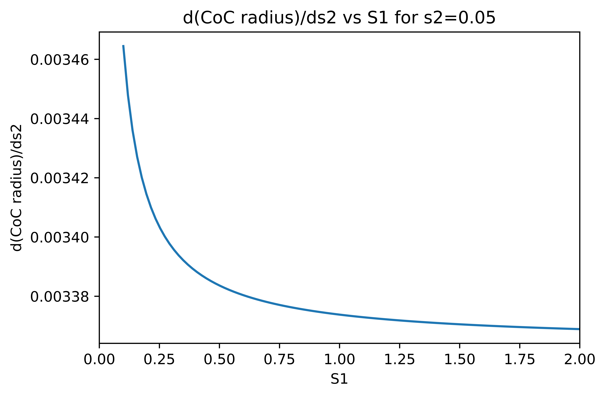
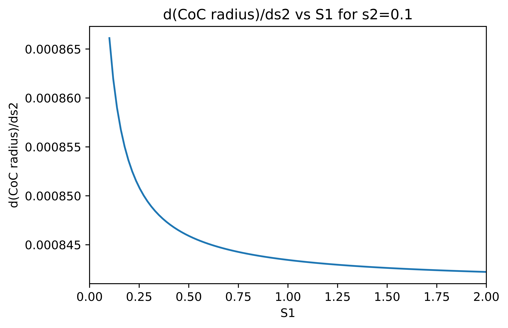
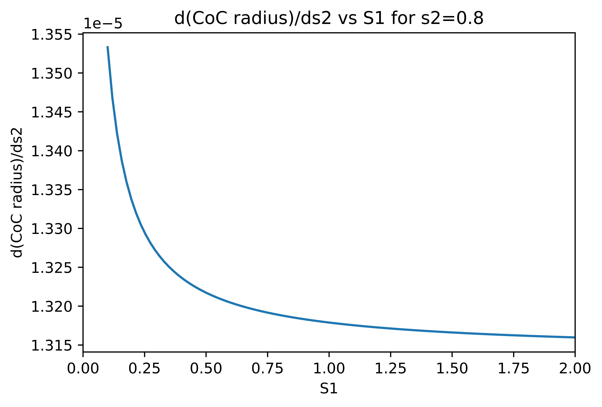
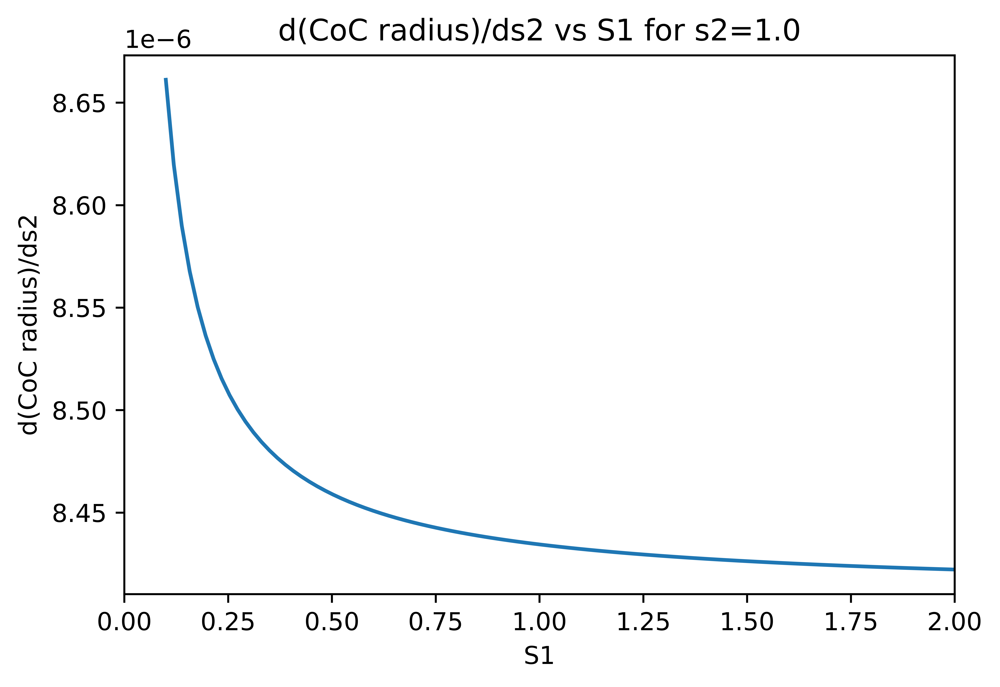
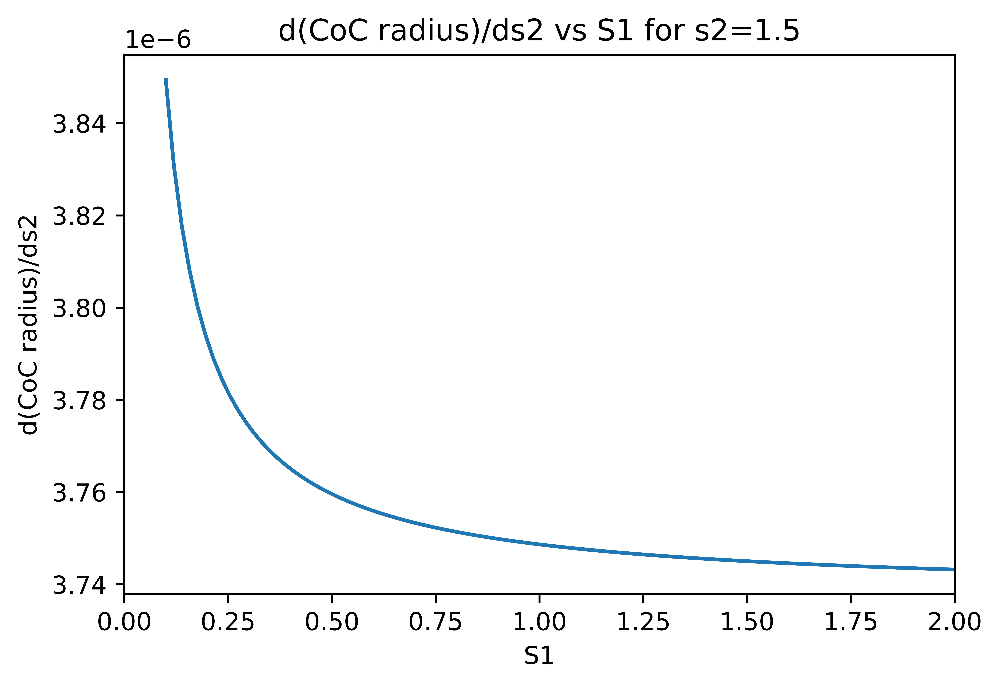
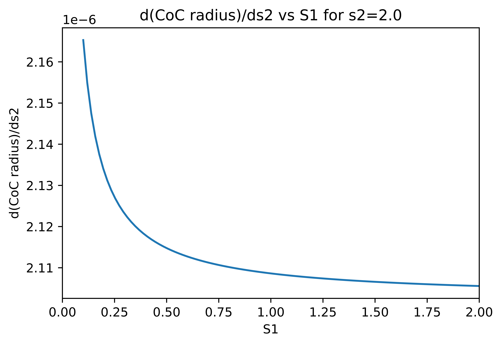

# Analyzing depth equation 

The radius of the Circle of Confusion (CoC) depends on other parameters according to the following equation:

$$|S_2-S_1|f^2 \over S_1N(S_1-f) $$

where $S_1$ is the focal distance, $S_2$ is the distance to the object point, $f$ is the focal length \
and $N$ is the f-number of the lense.

The variation of $CoC$ vs $S_1$ for different values of $S_2$ can be plot as the figure bellow. This was plot for the camera parameters used to generate the synthetic dataset for the paper "Focus on defocus: bridging the synthetic to real domain gap for depth estimation" by Maximov et.al (2020). These parameter and the dataset can be found at \
https://github.com/dvl-tum/defocus-net

{:height="36px" width="36px"}.

Then seperate plots were generated of different values of $S_2$

